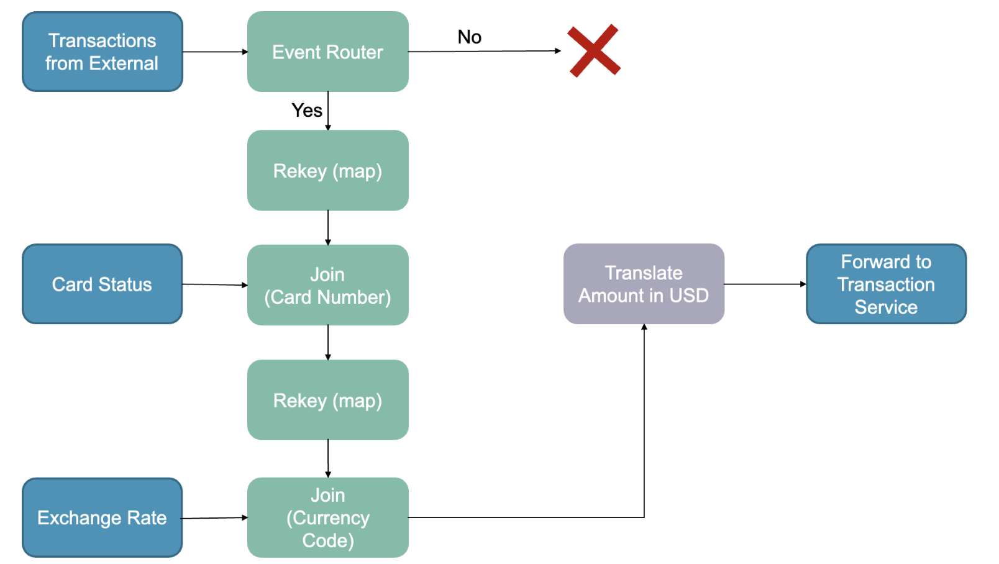

# Topology Descriptions

## Transaction Preprocessing Topology

### Topology description

- **Transactions from External**: All transactions going into our system from outside arrive here. Since the fraud detection is based on past transactions with the same card, they need to be in order. That is why we use a **K-Stream** here.
- **Card Status**: We store the status of every single card used in a transaction. Therefore, the keyspace can grow very large. As a consequence, we implemented this with a **K-Table**. As the order of the cards does not really matter, time synchronized processing is not a decisive factor.
- **Exchange Rate**: We need to store the exchange rate to USD for every currency we accept. As the number of currencies is inherently limited, so is the keyspace. Therefore, a **Global K-Table** is used. Other than that, the exchange rates should be globally replicated. The order of the rates does not really matter, time synchronized processing is not a decisive factor.
- **Event Router**: At this point, we filter out transactions coming from cards not issued by us by leveraging an **Event Router**. We also could have used an event filter but consciously decided on a router as we probably want to analyze the "foreign" transactions in some way. Therefore, we do not want to discard them.
- **Map**: We join the transaction with the card status based on the card number. Therefore, we rekey the transaction here.
- **Join**: We enrich the transaction with the card status, as we want to be able to reject transactions from an inactive card at the beginning of the approval process to save unnecessary computing.
- **Map**: We join the transaction with the exchange rate status based on the currency code. Therefore, we rekey the transaction here.
- **Join**: The transaction is enriched with the current exchange rate from the respective currency to USD.
- **Translate Amount in USD**: Technically, the incoming transaction could use every potential currency. For our fraud detection model, it would make sense to standardize that (comparability). Therefore, we compute the corresponding amount in USD here. The **Event Translation** processor type is implemented here.

### Other considerations

- We consciously do not use Avro here. If we wanted to do this, the incoming transactions from third parties would also need to be in the Avro format. Even though we could share the Avro registry with third-party clients, and they could implement their systems to use Avro and our Avro schemas, we think this is not a good approach for interoperability. Therefore, we decided we wanted to use a more commonly used and open format JSON. We still have designed a contract how what incoming JSON objects have to look like.
- As we use the actual and up-to-date exchange rates from an external API, translating the amount is a **stateful action**.
- Partitioning does not play a role here because the transactions are processed independently from each other. Therefore, there is no real point in routing them in separate partitions.

### Trade-Offs

- The respective trade-offs introduced by the usage of the Processing with External Lookup Pattern are discussed in a [separate ADR.](./architecture/decisions/0009-use-caching-in-preprocessing.md)

## Transaction Postprocessing Topology

### Topology Description

- **All Transactions**: All transactions (accepted and rejected) arrive via Kafka to the Transaction Postprocessing Service. Here they are consumed via a **KStream**.
- **Content Filter**: Transactions coming from the Transaction Service contain information (e.g., PIN) that we don't need in the Fraud Detection workflow. This service removes this unnecessary information from the event.
- **Interactive Queries**: The transactions are queryable via an HTTP endpoint. This allows system users to query information on which transactions got accepted/rejected by the transaction service.

### Other considerations

- We are using **Avro** here to have a shared understanding of the Transaction Object between the different Services.
- The Avro schemas are stored in an Avro repository.
- The content filter used here is a **stateless** action as it is independent of any event before it

## Fraud Preprocessing Topology

### Topology Description

- **Filtered Transactions**: The content-filtered transactions arrive via Kafka to the Fraud Preprocessing Service. Here they are consumed via a **KStream**.
- **Custom timestamp extraction**: We extract the event time from the transaction event in order to use that time for the windowing. We believe the even time semantics to best fit our use case since we want to know about transactions that occurred at similar times, regardless of when they were ingested or processed. We use the partition time as a fallback when extracting the event time fails.
- **Map**: The first operation is to map the incoming transactions, such that their key is the card number used in the transaction. This then allows us to group by the card number when creating the aggregation later on.
- **Windowed Aggregation**: We then use a windowed aggregation to monitor if a card number (**groupByKey**) has a large number of transactions (**count**) in a short period of time (more than five transactions within 60 seconds). Here we use **tumbling window type**.
- **Suppress**: We suppress the aggregation for 5 seconds in order to allow for out-of-order events to be accounted for. This could be adjusted based on average delays in transactions, but we believe 5 seconds to be a safe first estimate
- **Filter**: We filter out counts that are lower than 5. This is because to constitute a significant number of transactions during a 60-second window, we need at least five transactions.
- **Interactive Queries**: We expose the aggregation results via an HTTP endpoint. This allows administrators to query the system and get reports of cards that have had events of many transactions within a short period.

### Other considerations

- This topology contains both **stateless** (e.g. map) and **stateful** (e.g. windowed aggregation) operations.

### Trade-Offs

- **Considerations due to Processing with Local State design pattern**:
- **Memory Usage**: Memory usage is an essential consideration for our use case since the service might have to cache a large number of transactions in order to do the aggregations. This is something that would have to be considered in production based on statistics on the number of transactions coming into the system.
- **Persistence**: Persistence is also an important consideration here. There could be the case where a service goes down and therefore loses up to 65 seconds of local data. However, we do not see this as being a significant issue since the probability of the service going down and that causing fraud to go undetected is very low (given the relatively small amount of fraudulent transactions as a proportion of total transactions). This probability is further reduced by the fact that the fraud detection would work on the transaction stream as well, so the fraud might be detected regardless.
- **Partitioning**: The usage of local state means that if we consume from multiple partitions, we will have to use Kafka's partitioning functionality to ensure that transactions from the same card number always go to the same partition. Otherwise, if two instances of this microservice consume transactions from the same card number but from separate partitions, then the local states and ultimately the aggregations will be inaccurate.
- **Window Type**: We chose the Tumbling window type for our windowed aggregations here. The drawback of this is that we can potentially have five transactions occur within 60 seconds but fall within two separate windows and thus not be counted. However, this is outweighed by the more significant drawbacks of the other window types. A hopping window does not make sense from a domain perspective as we do not want transactions to appear in two separate windows. This could cause an occurrence of 5 transactions arriving within a short period to be counted as two occurrences due to overlapping windows. We believe this to be worse for fraud detection than the drawback of the tumbling window. The session window does not make sense from a domain perspective since the window could become arbitrarily long, given that a card has a consistent stream of transactions. Therefore, this type does not match our needs. Lastly, the semantics of the sliding join and aggregation windows do not check our domain problem.

## Avro Discussion

Trade-offs:

- Avro gives an easy option to manage TransferObjects. But also adds complexity and dependency on the Avro framework.
- We decided that we want to use Avro as we share a standard Transaction Class over multiple servers. Avro helps to sync this over all servers without changing each service individually when the Transaction Class changes.
