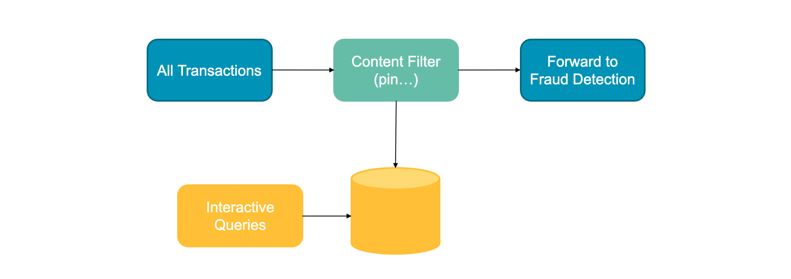
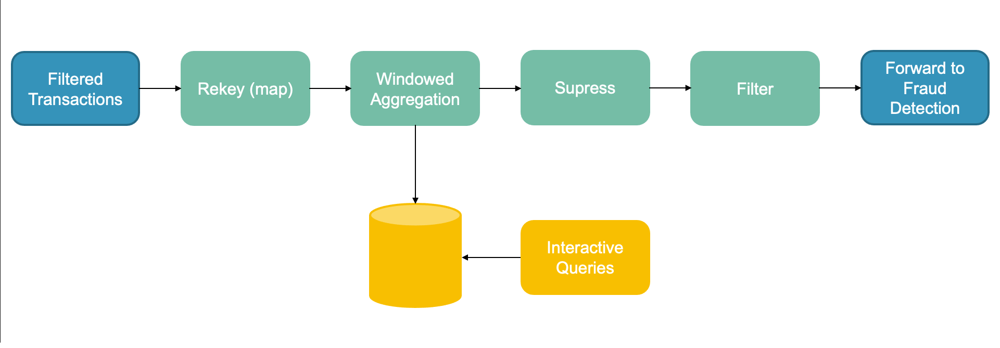

# Topology Descriptions

## Transaction Preprocessing Topology

TODO JONAS - Remember to embed the image in text

## Transaction Postprocessing Topology

### Topology Description
- **All Transactions**: All transactions (accepted and rejected) arrive via Kafka to the Transaction Postprocessing Service. Here they are consumed via a **KStream**.
- **Content Filter**: Transactions coming from the Transaction Service contain information (e.g. PIN) which we don't need in the Fraud Detection workflow. This service removes this unnecessary information from the event.
- **Interactive Queries**: The transactions are quariable via an http endpoint. This allows system users to query information on which transactions got accepted/rejected by the transaction service.

### Other considerations
- We are using **Avro** here to have a shared understand of the Transaction Object between the different Services.
  - The Avro schemas are stored in a avro repository.
## Fraud Preprocessing Topology

### Topology Description
- **Filtered Transactions**: The content-filtered transactions arrive via Kafka to the Fraud Preprocessing Service. Here they are consumed via a **KStream**.
  - **Custom timestamp extraction**: We extract the event time from the transaction event in order to use that time for the windowing. We believe the even time semantics to best fit our use case since we want to know about transactions that occurred at similar times, regardless of when they were ingested or processed. We use the partition time as a fallback when extracting the event time fails. 
- **Map**: The first operation is to map the incoming transactions. This is done because the incoming transactions do not have any key. Therefore, we map the transactions such that their key is the card number used in the transaction. This then allows us to group by the card number when creating the aggregation later on.
TODO THE KEY IS NOT EMPTY, WHAT IS IT?
- **Windowed Aggregation**: We then use a windowed aggregation to monitor if a card number (**groupByKey**) has a large number of transactions (**count**) in a short period of time (more than 5 transactions within 60 seconds). Here we use **tumbling window type**.
- **Suppress**: We suppress the aggregation for 5 seconds in order to allow for out of order events to be accounted for. This could be adjusted based on average delays in transactions but we believe 5 seconds to be a safe first estimate 
- **Filter**: We filter out counts that are lower than 5. This is because to constitute a significant number of transactions during a 60 second window we need at least 5 transactions. 
- **Interactive Queries**: We expose the aggregation results via an http endpoint. This allows administrators of the to query the system and get reports of cards that have had events of a large number of transactions within a short period of time

### Trade-Offs

- **Considerations due to Processing with Local State design pattern**:
  - **Memory usage**: Memory usage is an important consideration for our use case since the service might have to cache a large number of transactions in order to do the aggregations. This is something that would have to be considered in production based on statistics on the number of transactions coming into the system.
  - **Persistence**: Persistence is also an important consideration here. There could be the case where a service goes down and therefore loses up to 65 seconds of local data. However, we do not see this as being a major issue since the probability of the service going down and that causing fraud to go undetected is very low (given the relatively small amount of fraudulent transactions as a proportion of total transactions). This probability is further reduced by the fact that the fraud detection would work on the transaction stream as well, so the fraud might be detected regardless.
- **Window Type**: We chose the Tumbling window type for our windowed aggregations here. The drawback of this is that we can potentially have 5 transactions occur within 60 seconds but fall within two separate windows and thus not be counted. However, this is outweighted by the larger drawbacks of the other window types. A hopping window does not make sense from a domain perspective as we do not want transactions to appear in two separate windows. This could cause an occurance of 5 transactions arriving within a short period of time to be counted as two occurances due to overlapping windows. We believe this to be worse for the fraud detection than the drawback of the tumbling window. The session window does also not make sense from a domain perspective since the window could become abitrarily long given that a card has a consistent stream of transactions. Therefore, this type does not match our needs. Lastly, the semantics of the sliding join and aggregation windows do not match our domain problem.  

## Avro Discussion

TODO Kris talk to Marcel about final Avro implementations and add here discussion of where we use it and why

Trade-offs: 
- Avro gives an easy option to manage TransferObjects. But also adds complexity and depenedability on the avro framework.
- We decided that we want to use Avro in the second part as we share a common Transaction Class over multiple servers. Avro helps as to sync this over all servers, without changing each service individually when the Transaction Class changes.
